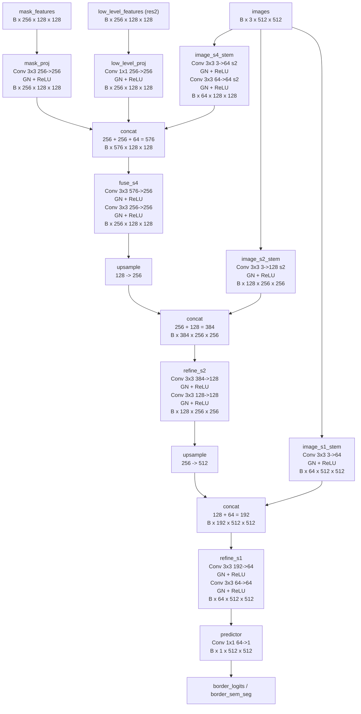

# モデル構造概要台帳

## 運用ルール

- このファイルは border head 専用ではなく、追加・変更したモデル構造全般の概要を残す。
- 構造を変更・追加したときは、新しいセクションを追加する。
- 以前の構造説明は削除しない。
- 新しい構造が以前の構造と互換でない場合は、古いセクションのタイトルに `破棄` を付ける。
- 学習や再評価を追加で回したときは、対応する output と log を該当セクションへ追記する。

## 構造セクション一覧

- [2026-05-11 border head 初版](#2026-05-11-border-head-初版)

## 2026-05-11 border head 初版

### 対象

- 追加した dense border prediction head
- 実装本体: [maskdino/modeling/meta_arch/border_head.py](../maskdino/modeling/meta_arch/border_head.py)
- 組み込み箇所: [maskdino/modeling/meta_arch/maskdino_head.py](../maskdino/modeling/meta_arch/maskdino_head.py)
- loss / 推論出力: [maskdino/maskdino.py](../maskdino/maskdino.py)

### 概要

- 役割: 漫画の枠線 border を 1ch の dense map として予測する。
- 入力:
  - `mask_features`: `B x 256 x 128 x 128`
  - `low_level_features (res2)`: `B x 256 x 128 x 128`
  - `images`: `B x 3 x 512 x 512`
- 出力:
  - `border_logits`: `B x 1 x 512 x 512`
  - 推論時は `sigmoid` 後の `border_sem_seg`
- 学習 loss:
  - `loss_border_bce`
  - `loss_border_dice`

### 主な層とサイズ

| 名前 | 主な構造 | 入力サイズ | 出力サイズ |
| --- | --- | --- | --- |
| `mask_proj` | `Conv 3x3 256->256` + `GN` + `ReLU` | `B x 256 x 128 x 128` | `B x 256 x 128 x 128` |
| `low_level_proj` | `Conv 1x1 256->256` + `GN` + `ReLU` | `B x 256 x 128 x 128` | `B x 256 x 128 x 128` |
| `image_s4_stem` | `Conv 3x3 3->64 s2` + `GN` + `ReLU` x2 | `B x 3 x 512 x 512` | `B x 64 x 128 x 128` |
| `fuse_s4` | `Conv 3x3 576->256` + `GN` + `ReLU` x2 | `B x 576 x 128 x 128` | `B x 256 x 128 x 128` |
| `image_s2_stem` | `Conv 3x3 3->128 s2` + `GN` + `ReLU` | `B x 3 x 512 x 512` | `B x 128 x 256 x 256` |
| `refine_s2` | `Conv 3x3 384->128` + `GN` + `ReLU` x2 | `B x 384 x 256 x 256` | `B x 128 x 256 x 256` |
| `image_s1_stem` | `Conv 3x3 3->64` + `GN` + `ReLU` | `B x 3 x 512 x 512` | `B x 64 x 512 x 512` |
| `refine_s1` | `Conv 3x3 192->64` + `GN` + `ReLU` x2 | `B x 192 x 512 x 512` | `B x 64 x 512 x 512` |
| `predictor` | `Conv 1x1 64->1` | `B x 64 x 512 x 512` | `B x 1 x 512 x 512` |

### Mermaid 図

`pixel encoder` 自体は省略し、border head が受ける入力から描く。

### 対応する設定

- border-only / frozen:
  - [configs/manga/border_head_semantic_2601_ref.yaml](../configs/manga/border_head_semantic_2601_ref.yaml)
- border-only / pixel decoder 非凍結:
  - [configs/manga/border_head_semantic_2601_ref_unfreeze_pixel_decoder.yaml](../configs/manga/border_head_semantic_2601_ref_unfreeze_pixel_decoder.yaml)
- multitask:
  - [configs/manga/border_head_semantic_2601_multitask.yaml](../configs/manga/border_head_semantic_2601_multitask.yaml)

### 対応する output フォルダとログ

#### 学習 run

- border-only / frozen:
  - 出力: [output/border_head_semantic_2601_ref_split_frozen_fixedpad](../output/border_head_semantic_2601_ref_split_frozen_fixedpad)
  - checkpoint: [output/border_head_semantic_2601_ref_split_frozen_fixedpad/model_final.pth](../output/border_head_semantic_2601_ref_split_frozen_fixedpad/model_final.pth)
  - inference checkpoint: [output/border_head_semantic_2601_ref_split_frozen_fixedpad/model_final_inference.pth](../output/border_head_semantic_2601_ref_split_frozen_fixedpad/model_final_inference.pth)
  - log: [output/border_head_semantic_2601_ref_split_frozen_fixedpad/log.txt](../output/border_head_semantic_2601_ref_split_frozen_fixedpad/log.txt)

- border-only / pixel decoder 非凍結:
  - 出力: [output/border_head_semantic_2601_ref_unfreeze_pixel_decoder](../output/border_head_semantic_2601_ref_unfreeze_pixel_decoder)
  - checkpoint: [output/border_head_semantic_2601_ref_unfreeze_pixel_decoder/model_final.pth](../output/border_head_semantic_2601_ref_unfreeze_pixel_decoder/model_final.pth)
  - inference checkpoint: [output/border_head_semantic_2601_ref_unfreeze_pixel_decoder/model_final_inference.pth](../output/border_head_semantic_2601_ref_unfreeze_pixel_decoder/model_final_inference.pth)
  - log: [output/border_head_semantic_2601_ref_unfreeze_pixel_decoder/log.txt](../output/border_head_semantic_2601_ref_unfreeze_pixel_decoder/log.txt)

- multitask / 旧実装:
  - 出力: [output/border_head_semantic_2601_multitask_eval](../output/border_head_semantic_2601_multitask_eval)
  - checkpoint: [output/border_head_semantic_2601_multitask_eval/model_final.pth](../output/border_head_semantic_2601_multitask_eval/model_final.pth)
  - inference checkpoint: [output/border_head_semantic_2601_multitask_eval/model_final_inference.pth](../output/border_head_semantic_2601_multitask_eval/model_final_inference.pth)
  - log: [output/border_head_semantic_2601_multitask_eval/log.txt](../output/border_head_semantic_2601_multitask_eval/log.txt)

- multitask / task-gated 修正版:
  - 出力: [output/border_head_semantic_2601_multitask_taskgated](../output/border_head_semantic_2601_multitask_taskgated)
  - checkpoint: [output/border_head_semantic_2601_multitask_taskgated/model_final.pth](../output/border_head_semantic_2601_multitask_taskgated/model_final.pth)
  - inference checkpoint: [output/border_head_semantic_2601_multitask_taskgated/model_final_inference.pth](../output/border_head_semantic_2601_multitask_taskgated/model_final_inference.pth)
  - log: [output/border_head_semantic_2601_multitask_taskgated/log.txt](../output/border_head_semantic_2601_multitask_taskgated/log.txt)

#### 再評価 run

- baseline / box 2 ルート再評価:
  - 出力: [output/baseline_eval_box_routes_512_fixed](../output/baseline_eval_box_routes_512_fixed)
  - log: [output/baseline_eval_box_routes_512_fixed/log.txt](../output/baseline_eval_box_routes_512_fixed/log.txt)
  - baseline inference checkpoint: [output/251210_baseline/model_final_inference.pth](../output/251210_baseline/model_final_inference.pth)

- border-only / frozen / box 2 ルート再評価:
  - 出力: [output/border_head_semantic_2601_ref_split_frozen_fixedpad_eval_box_routes_fixed](../output/border_head_semantic_2601_ref_split_frozen_fixedpad_eval_box_routes_fixed)
  - log: [output/border_head_semantic_2601_ref_split_frozen_fixedpad_eval_box_routes_fixed/log.txt](../output/border_head_semantic_2601_ref_split_frozen_fixedpad_eval_box_routes_fixed/log.txt)

- border-only / pixel decoder 非凍結 / box 2 ルート再評価:
  - 出力: [output/border_head_semantic_2601_ref_unfreeze_pixel_decoder_eval_box_routes_fixed](../output/border_head_semantic_2601_ref_unfreeze_pixel_decoder_eval_box_routes_fixed)
  - log: [output/border_head_semantic_2601_ref_unfreeze_pixel_decoder_eval_box_routes_fixed/log.txt](../output/border_head_semantic_2601_ref_unfreeze_pixel_decoder_eval_box_routes_fixed/log.txt)

- multitask / 旧実装 / box 2 ルート再評価:
  - 出力: [output/border_head_semantic_2601_multitask_eval_box_routes_fixed](../output/border_head_semantic_2601_multitask_eval_box_routes_fixed)
  - log: [output/border_head_semantic_2601_multitask_eval_box_routes_fixed/log.txt](../output/border_head_semantic_2601_multitask_eval_box_routes_fixed/log.txt)

- multitask / task-gated 修正版 / box 2 ルート再評価:
  - 出力: [output/border_head_semantic_2601_multitask_taskgated_eval_box_routes_fixed](../output/border_head_semantic_2601_multitask_taskgated_eval_box_routes_fixed)
  - log: [output/border_head_semantic_2601_multitask_taskgated_eval_box_routes_fixed/log.txt](../output/border_head_semantic_2601_multitask_taskgated_eval_box_routes_fixed/log.txt)

### 精度評価表

| モデル | border F1 | border IoU | bbox AP (`pred box`) | bbox AP (`mask-derived box`) | segm AP |
| --- | ---: | ---: | ---: | ---: | ---: |
| baseline instance | - | - | 40.2311 | 85.6403 | 89.7121 |
| border-only / frozen | 38.0863 | 23.5226 | 40.2311 | 85.6403 | 89.7121 |
| border-only / pixel decoder 非凍結 | 37.4147 | 23.0123 | 0.7914 | 0.7826 | 0.7216 |
| multitask / 旧実装 | 22.8076 | 12.8717 | 39.9480 | 83.0157 | 87.3049 |
| multitask / task-gated 修正版 | 29.8913 | 17.5719 | 41.8026 | 84.0438 | 88.5807 |
